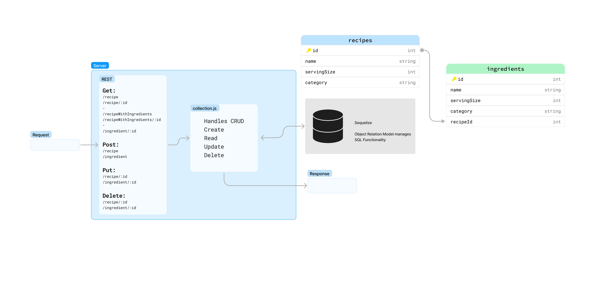

# LAB - Class 03

## Project: API Server

### Author: Donna Ada

### Problem Domain

Build a REST API using Express, by creating a proper series of endpoints that perform CRUD operations on a Postgres SQL Database, using the REST standard.

#### Person Route

#### #Add a Record

- CRUD Operation: Create
- REST Method: POST
- Path: /food
- Input: JSON Object in the Request Body
- Returns: The record that was added to the database.
  - You must generate an ID and attach it to the object.
  - You should verify that only the fields you define get saved as a record.

#### #Get All Records

- CRUD Operation: Read
- REST Method: GET
- Path: /food
- Returns: An array of objects, each object being one entry from your database.

#### #Get One Record

- CRUD Operation: Read
- REST Method: GET
- Path: /food/1
- Returns: The object from the database, which has the id matching that which is in the path.

#### #Update a Record

- CRUD Operation: Update
- REST Method: PUT
- Path: /food/1
- Input: JSON Object in the Request Body
- Returns: The object from the database, which has the id matching that which is in the path, with the updated/changed data.
You should verify that only the fields you define get saved as a record.

#### #Delete a Record

- CRUD Operation: Destroy
- REST Method: DELETE
- Path: /food/1
- Returns: The record from the database as it exists after you delete it (i.e. null).

### Links and Resources

- [GitHub Actions ci/cd](https://github.com/donnaada/api-server/actions)
- [back-end server url](https://api-server-6a4s.onrender.com)
-

### Collaborators

Referenced Ryan Gallaway's Demo Code
Help on associations from Aaron Imbrock

### Setup

#### `.env` requirements (where applicable)

Port variable located within .env.sample

#### How to initialize/run your application (where applicable)

- e.g. `npm start`

#### How to use your library (where applicable)

Clone repo, npm i, then run nodemon in terminal

#### Features / Routes

- Feature One: Details of feature
- GET : `/person` - specific route to hit with query?name=name

#### Tests

To Run tests, run the command npm test

- 404 on a bad route
- 404 on a bad method
- The correct status codes and returned data for each REST route
  - Create a record using POST
  - Read a list of records using GET
  - Read a record using GET
  - Update a record using PUT
  - Destroy a record using DELETE

#### UML

